# AxureStudy
学习Axure的过程

# 注意事项

​		1、Axure 中 component（**组件**） 是单独罗列出来的，在 版本10中代替了 9 的Master 的， 所以在学习的时候，对于按钮、label、标题等统一称为 **部件** 或者  **按钮**. 

​		2、Axure 的交互由 enevt(事件) -> cases (情况) ->Actions(动作) 组成。 即对一个部件添加交互的时候需要先添加 这个 部件的事件，比如 点击、单击、双击、text change 等 ， 再在对应的事件下添加 情况（非必选  可以直接添加动作），最后添加 相应的 动作

​		3、参照 哔哩哔哩上的课程 ：

​				 [Axure 9 全面教程：所有功能讲解+高级效果实现]([Axure 9 全面教程：所有功能讲解+高级效果实现_哔哩哔哩_bilibili](https://www.bilibili.com/video/BV18t411p7ex?p=1)) 

​				([(17条消息) Axure_阿甘兄-CSDN博客](https://blog.csdn.net/qq_20042935/category_9823775.html))

## 已学习

​		1、官网的 Axure中文版使用指南 PPT 文件初步认识软件界面


## 待学习

​		2、将Axure中文版使用指南 PPT文件读完

 [【官方】Axure9.0产品经理（全集）【2021最新】/大饼老师原创视频（1080p）_哔哩哔哩_bilibili](https://www.bilibili.com/video/BV184411g7R2?p=9)


[Axure 9 全面教程：所有功能讲解+高级效果实现_哔哩哔哩_bilibili](https://www.bilibili.com/video/BV18t411p7ex?from=search&seid=17325911429516440402&spm_id_from=333.337.0.0)


## Axure10的部分变化

### 		**组件（Componnets）代替模板（Master）**

​			**动态面板：**

```
主要用途就是实现一些动态的交互效果。所以，如果动态面板使用不熟悉的话，对axure原型的制作会有很大的影响。
作用：
  	1、  隐藏与显示

	2、  滑动效果

	3、  拖动效果

	4、  多状态效果
```


## 界面交互

```
界面交互：
	用户对界面元素进行操作后，界面对这个操作产生回应的过程
事件 动作 情况

```


###  案例1、点击按钮进行跳转

​		添加一个按钮，点击后跳转到其他的页面

1、新建一个文件 ==> 新建文件夹（用于区分类别）   


2、页面1 添加按钮和点击事件

​		添加按钮后，点击选中按钮 ==》 点击 右侧的 **interaction** （交互界面） 添加一个新的动作 == > 当点击的时候  ==》 添加情况 ：点击 相应动作下的选项框 ==》 选择 **open link** (打开链接) ==》 选项需要跳转的页面或者url

	


3、预览结果

​	点击右上方的 预览按钮进行预览


### 案例2、简易博客原型图

[Axure 9 全面教程：所有功能讲解+高级效果实现_哔哩哔哩_bilibili](https://www.bilibili.com/video/BV18t411p7ex?p=6&spm_id_from=pageDriver)

注意：

1. 各个标签的位置，不然颜色无法覆盖到全部。

2. 多个组件一起移动：

   使用 shift 选中多个组件，在通过鼠标右键移动  

3. 多个组件一起复制：

   使用 shift 选中多个组件， + ctrl 键 + 鼠标右键拖动

## 1、Axure 事件


## 2、Axure 动作


## 3、Component  组件的使用

​	将多个部件绑定在一起，一起作为一个部件。使用 shift 选定多个部件，右键选择 create Component 就会创建一个组件，通过移动到具体的页面进行使用. 

​	修改 Component   后所有使用 Component   的页面都会进行相应的修改。

​	同理还可以新建或者修改已有的样式。


## 4、Widget Style 

​		部件的样式可以进行修改， 点击上不的  这个图标或者 顶部菜单栏 == 》project ==> Widget Style Manager 


## 5、让 component 里面的按钮在不同的页面作出不同的反应

​		一般是在 component 中的部件在不同的页面作出不同的反应。

​		在  **component**  中点击某一个按钮，在左侧的 **interaction** 添加动作的时候（比如点击的时候） 选择下面的 Raise Event （抛出事件）， 并添加事件修改这个添加的事件的名字。

​		最后在每个应用 component 的页面进行相应的事件绑定，比如在 **首页** 点击这个按钮添加事件的时候就可以选择我们刚刚添加的事件，并对这个事件选择相应的动作。 比如  Show / hide .


## 6、不切换页面单是内容动态变换 - Dynamic Panel 

​		使用：**动态面板**

​		这种交互通常使用 **动态面板** 

## 7、实现Tab标签-Selection Group

​		前面实现的登录框，都是属于选中状态，是不对的。正确的是当点击密码登录的时候， 快速登录 选项是未选中，为灰色的。

​		选中需要组合的部件，右键选择 Selection Group

### 		**部件** ：  

​			Dynamic Panel  、Selection Group

### 		**过程：**

#### 			1、Selection Group

​				使用 shift 选中所有需要设置的部件，此时为 **密码登录框** 、 **快速登录** ，右键 **Selection Group** 进行组合


#### 

#### 2、 新添加 **按钮选中样式**

1、打开 **Widget Style Manager**  面板： 

1.  菜单栏 **project** ->  **Widget Style Manager**
2. 工具栏： 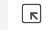

2、点击 **Widget Style Manager**  面板 上面 **add** 进行添加样式， 设置填充为 **白色**


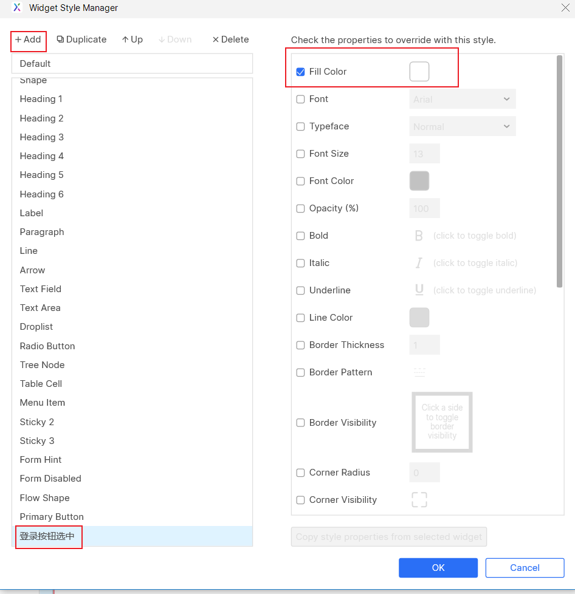


#### 3、为两个部件分别设置 选中的样式： 

​		点击第一个按钮，点击左侧的 **shape properties** (形状属性)  的 **selection Group** 选择我们新建的 **selection Group** ；

点击 **Add Style Effect** 设置选中的样式；点击 **Show all** 将第一个按钮设置为默认选中状态

​		点击第二个按钮同样的进行设置。只是不设置为默认选中

​		


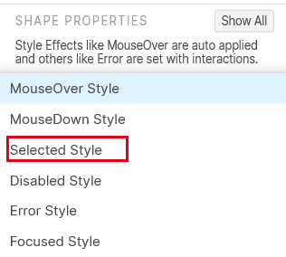

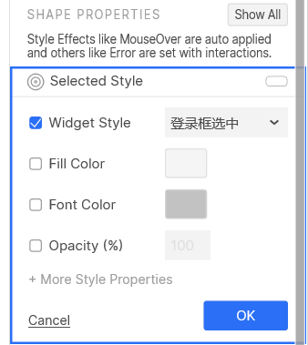

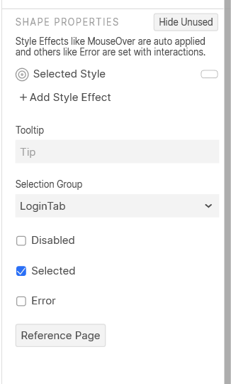


#### 4、为两个按钮设置选中的动作

1. 选中第一个按钮，在原来的**点击** 的事件下新建添加一个 **Action **  为 **selected**

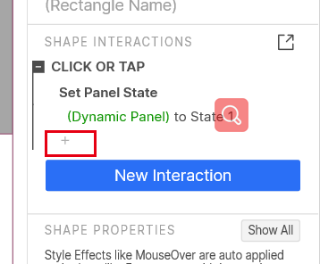

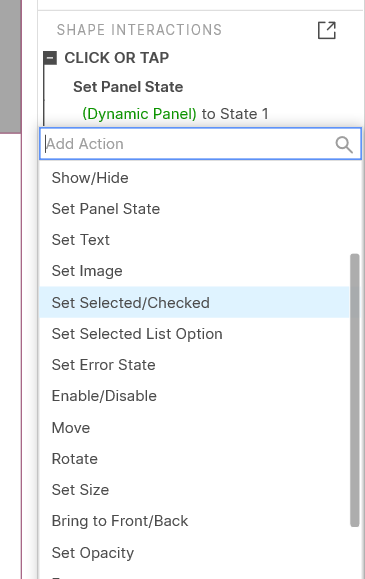

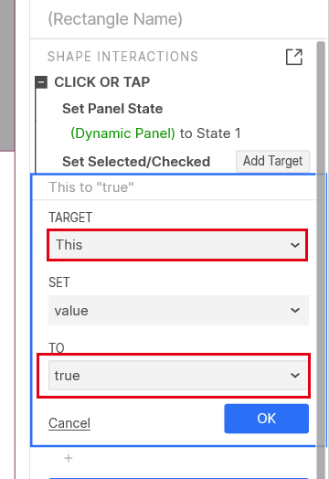


#### 5、最终样式

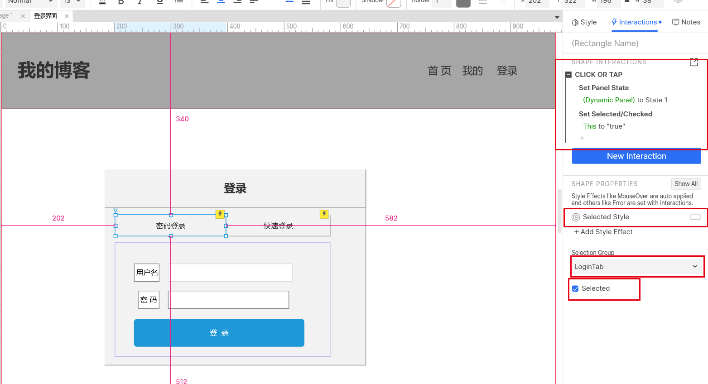

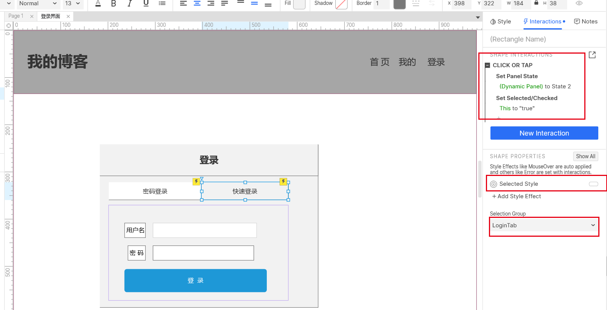


## 8、变量、表达式 - 案例 计算商品总价

[Axure快速入门（09） -变量和表达式（计算商品总价例子]([(17条消息) Axure快速入门（09） -变量和表达式（计算商品总价例子）_阿甘兄-CSDN博客](https://blog.csdn.net/qq_20042935/article/details/112506389))

**元件组成**： 左侧是 box 框显示 单价、数量、总价；右侧是文本框可以属于文字、数字，才能进行计算。

**过程**： 

​	1、将总价显示框 设置一个 text change 事件； 添加  set text 动作，选择相应的目标框和 value ；

​	2、设置value 的时候 添加本地变量 和 表达式， 每一个变量对应一个相应的文本框的值， 表达式使用 [[ ]] 括起来。

​	3、 最后将三个文本框（单价、数量、总价）设置同样的事件，可以通过 复制 粘贴进行快速设置。

​	4、预览

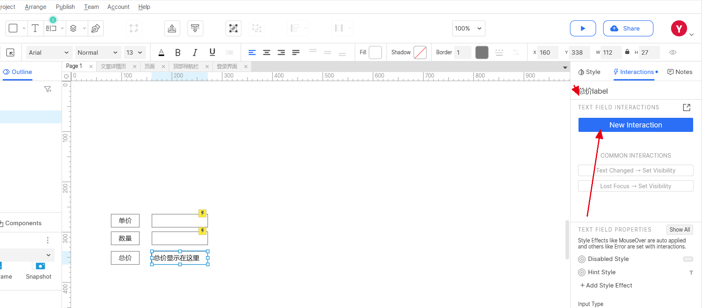

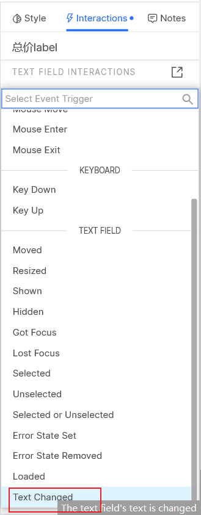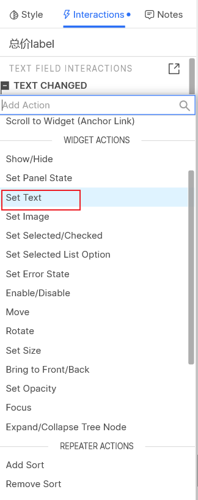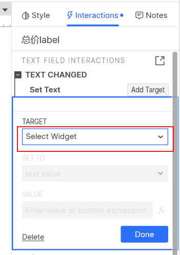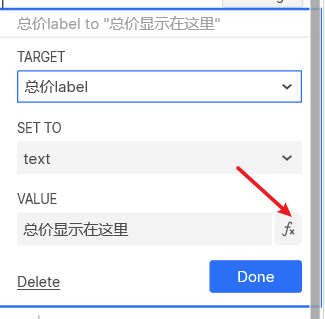

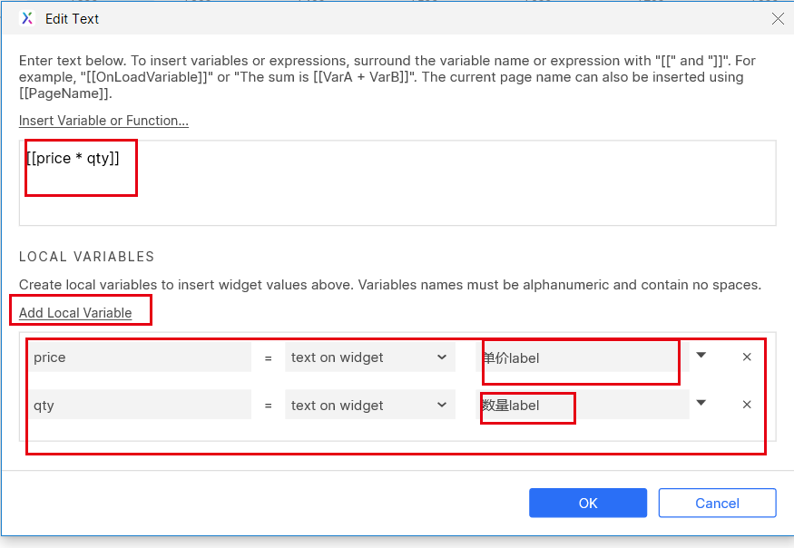

**预览**

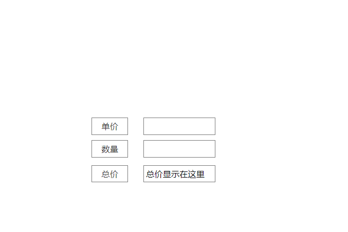

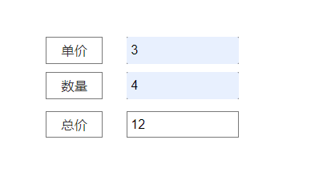

## 9、带有条件的事件 - 手机号为11位的时候才能点击发送验证码

​		在满足某些条件的时候进行相应的操作。

### **部件**：

1. **文本框**：用于获取手机号
2. **box**：显示“手机号” 文本和显示一个边框 
3. **按钮**：用于触发事件

### **过程：**

#### 1、设置原形图

​	此时未设置任何样式

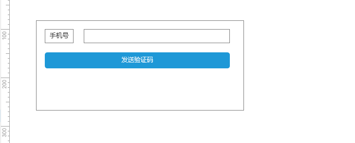

#### 2、设置按钮禁用状态和样式

##### 	1、按钮默认设置**禁用**状态的样式

​			右键 -》 style Effects -》disable 

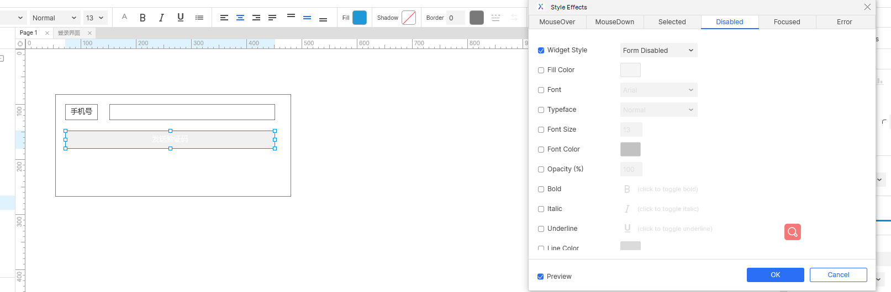

##### 2、设置按钮为  **禁用** 为默认状态

​		 右键 -》 disable 

​		此时预览会发现按钮为灰色状态

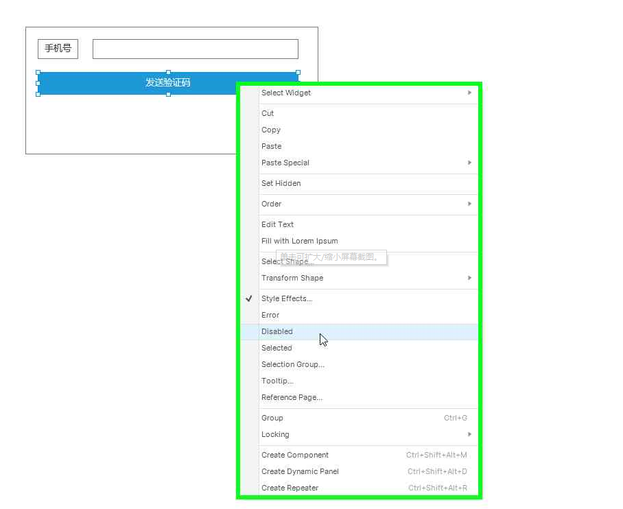

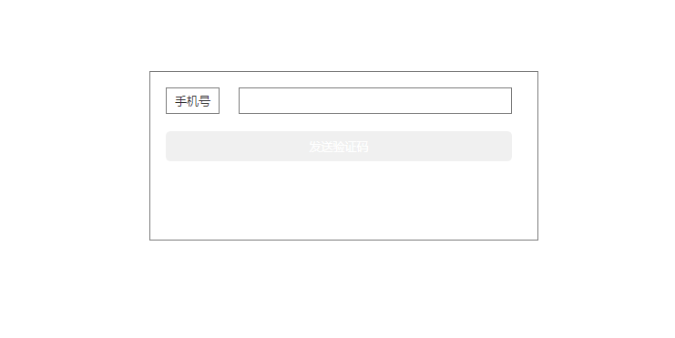

#### 3、为文本框设置条件

​		1、**选中文本框** -》 左侧添加交互 **new Iteraction** => 添加event **Text Change**  ==>  

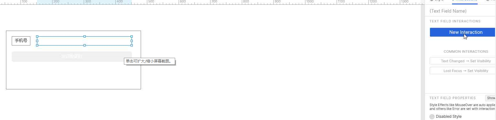

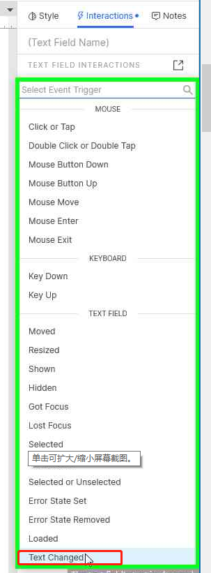

2、添加 case1 当文本框的值等于 11 位的时候

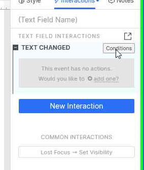


3、为 cases1 设置 action ,当满足cases 1的时候 **发送验证码按钮** 设置为 **Enable** 状态

​		点击 case1 会出现 Add Action ,添加 **Enable/Unable** 动作，设置满足该 case1 时 **发送验证码按钮** 的 action 为 **Enable**

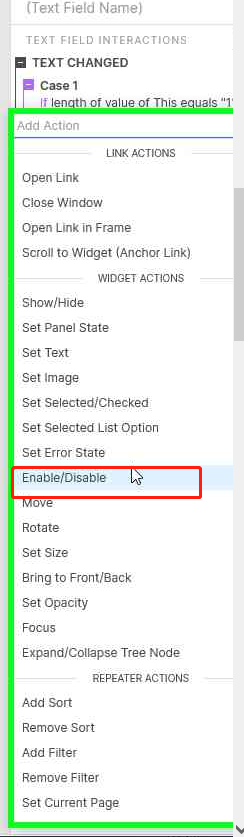

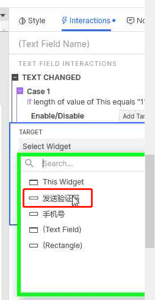

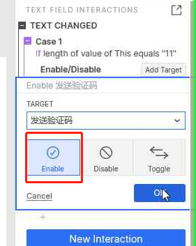

4、为文本框添加case2 ,不设置任何条件， 设置 case2 的 action ：**Enable/Unable** ，目标为：**发送验证码按钮**， 状态为： **Unable**

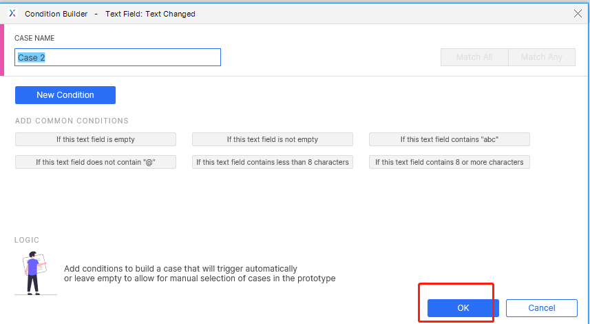

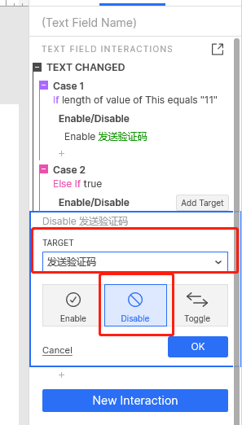

#### 4、预览

​	当满足11位的时候按钮可以使用，不满足的时候按钮不能使用

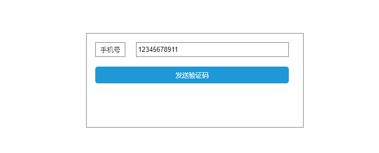

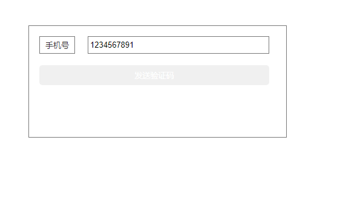

## 10、快捷键

Axure 也提供了部分快捷键快速的绘图：[Axure RP 9酷炫新功能：单键快捷键](https://www.axure.com.cn/77973)

其他的特性去官网查看


## 11、实战-轮播图

### **部件**：

1. 动态面板

### **过程**：

1、添加动态面板及内容

在页面中加入一个 **动态面板**，并为面板设置 **3**个 state ,分别将这三个 state 设置一个图片

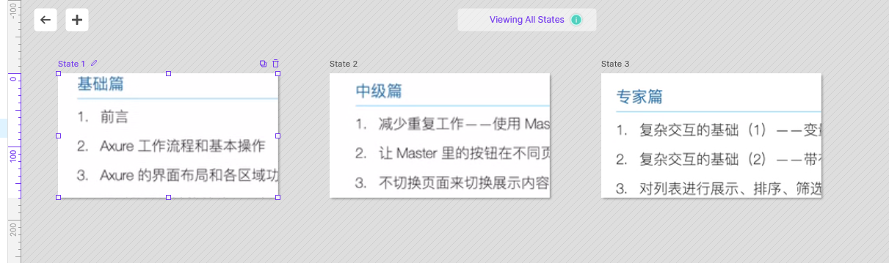

2、设置页面交互

​	点击页面添加一个 **New Interaction** : **Page Loaded**,

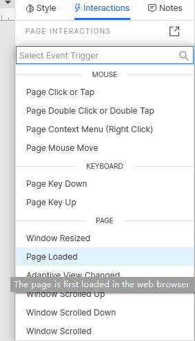

  设置 **atcion**： **Set Panel State** 

 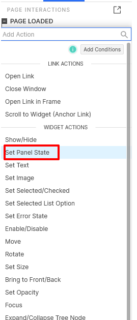

设置 面板的状态： 

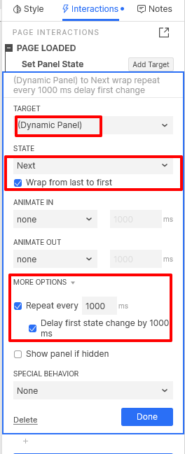

