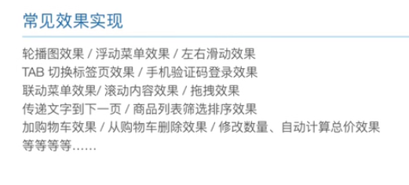
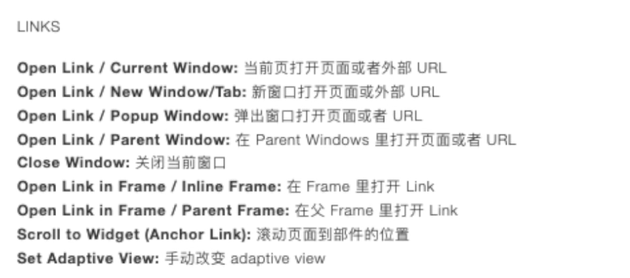

# AxureStudy
学习Axure的过程

# 注意事项

​		Axure 中 component（**组件**） 是单独罗列出来的，在 版本10中代替了 9 的Master 的， 所以在学习的时候，对于按钮、label、标题等统一称为 **部件** 或者  **按钮**. 

## 已学习

​		1、官网的 Axure中文版使用指南 PPT 文件初步认识软件界面

## 待学习

​		2、将Axure中文版使用指南 PPT文件读完

 [【官方】Axure9.0产品经理（全集）【2021最新】/大饼老师原创视频（1080p）_哔哩哔哩_bilibili](https://www.bilibili.com/video/BV184411g7R2?p=9)


[Axure 9 全面教程：所有功能讲解+高级效果实现_哔哩哔哩_bilibili](https://www.bilibili.com/video/BV18t411p7ex?from=search&seid=17325911429516440402&spm_id_from=333.337.0.0)




## Axure10的部分变化

### 		**组件（Componnets）代替模板（Master）**

​			**动态面板：**

```
主要用途就是实现一些动态的交互效果。所以，如果动态面板使用不熟悉的话，对axure原型的制作会有很大的影响。
作用：
  	1、  隐藏与显示

	2、  滑动效果

	3、  拖动效果

	4、  多状态效果
```


## 界面交互

```
界面交互：
	用户对界面元素进行操作后，界面对这个操作产生回应的过程
事件 动作 情况

```


###  案例1、点击按钮进行跳转

​		添加一个按钮，点击后跳转到其他的页面

1、新建一个文件 ==> 新建文件夹（用于区分类别）   


2、页面1 添加按钮和点击事件

​		添加按钮后，点击选中按钮 ==》 点击 右侧的 **interaction** （交互界面） 添加一个新的动作 == > 当点击的时候  ==》 添加情况 ：点击 相应动作下的选项框 ==》 选择 **open link** (打开链接) ==》 选项需要跳转的页面或者url

	


3、预览结果

​	点击右上方的 预览按钮进行预览


### 案例2、简易博客原型图

[Axure 9 全面教程：所有功能讲解+高级效果实现_哔哩哔哩_bilibili](https://www.bilibili.com/video/BV18t411p7ex?p=6&spm_id_from=pageDriver)

注意：

1. 各个标签的位置，不然颜色无法覆盖到全部。

2. 多个组件一起移动：

   使用 shift 选中多个组件，在通过鼠标右键移动  

3. 多个组件一起复制：

   使用 shift 选中多个组件， + ctrl 键 + 鼠标右键拖动

## 1、Axure 事件


## 2、Axure 动作




## 3、Component  组件的使用

​	将多个部件绑定在一起，一起作为一个部件。使用 shift 选定多个部件，右键选择 create Component 就会创建一个组件，通过移动到具体的页面进行使用. 

​	修改 Component   后所有使用 Component   的页面都会进行相应的修改。

​	同理还可以新建或者修改已有的样式。


## 4、Widget Style 

​		部件的样式可以进行修改， 点击上不的  这个图标或者 顶部菜单栏 == 》project ==> Widget Style Manager 


## 5、让 component 里面的按钮在不同的页面作出不同的反应

​		一般是在 component 中的部件在不同的页面作出不同的反应。

​		在  **component**  中点击某一个按钮，在左侧的 **interaction** 添加动作的时候（比如点击的时候） 选择下面的 Raise Event （抛出事件）， 并添加事件修改这个添加的事件的名字。

​		最后在每个应用 component 的页面进行相应的事件绑定，比如在 **首页** 点击这个按钮添加事件的时候就可以选择我们刚刚添加的事件，并对这个事件选择相应的动作。 比如  Show / hide .


## 6、不切换页面单是内容动态变换 - Dynamic Panel 

​		使用：**动态面板**

​		这种交互通常使用 **动态面板** 

## 7、实现Tab标签-Selection Group

​		前面实现的登录框，都是属于选中状态，是不对的。正确的是当点击密码登录的时候， 快速登录 选项是未选中，为灰色的。

​		选中需要组合的部件，右键选择 Selection Group

​		


需要新添加选中后的样式，


