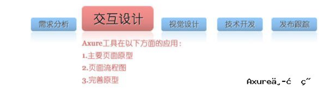

# axure 

## 入门：如何应用AxureRP做原型设计

​		用AxureRP来做原型设计的优点应该看的很多了，快速，可交互等等，

​		借用别人的一张图，主要从交互设计中涉及的三个主要步骤进行说明：就是先设计一个初始的主要页面原型，定义页面流程图，最后再完善原型的过程。

### 一、 主要页面原型

​		手绘一份草图，用来确认上面提到的与需求人员之间的理解差异，这份草图应有一个大致的轮廓，列出主要的功能，有一个很粗的页面布局等等。

注意页面复用;

​		AxureRP的**模板管理（Master）**功能

### 二、 页面流程图

​		在确定主要页面之后，就可以定义页面流程了。页面流程图有利于向大家展示自己的想法，也有利于思路的整理。可参加之前介绍AxureRP案例时提供的一共以流程图方式来说明登录注册功能的例子。通过页面流程图，可以整理页面的交互行为，在向他人展示的时候，也可以一目了然的看出需要的操作步骤是多少步。

​		页面与页面间的流程图可以用**AxureRP的站点地图面板**里面的自动生成流程的图的功能，要使用这个功能，就需要在设计之初就建立好页面的层级结构，比如一般都有首页，然后在首页下面按主要功能模快可能会分成几个页面，再在这些页面下建立各自的功能子页面，这样就是三层结构，自动生成出来的页面流程图结构也会很清晰，但前提就是要设计好结构，例如按页面分层次，按功能分层次等。

### 三、 完善原型

​		页面的主要页面和页面流程确定之后，就可以完善原型了。这时主要是一些细节的工作，包括前期设计页面的完善，以及一些交互功能的定义等等，也可以适当的加入一些视觉的东西，但还是不宜加入太多。

